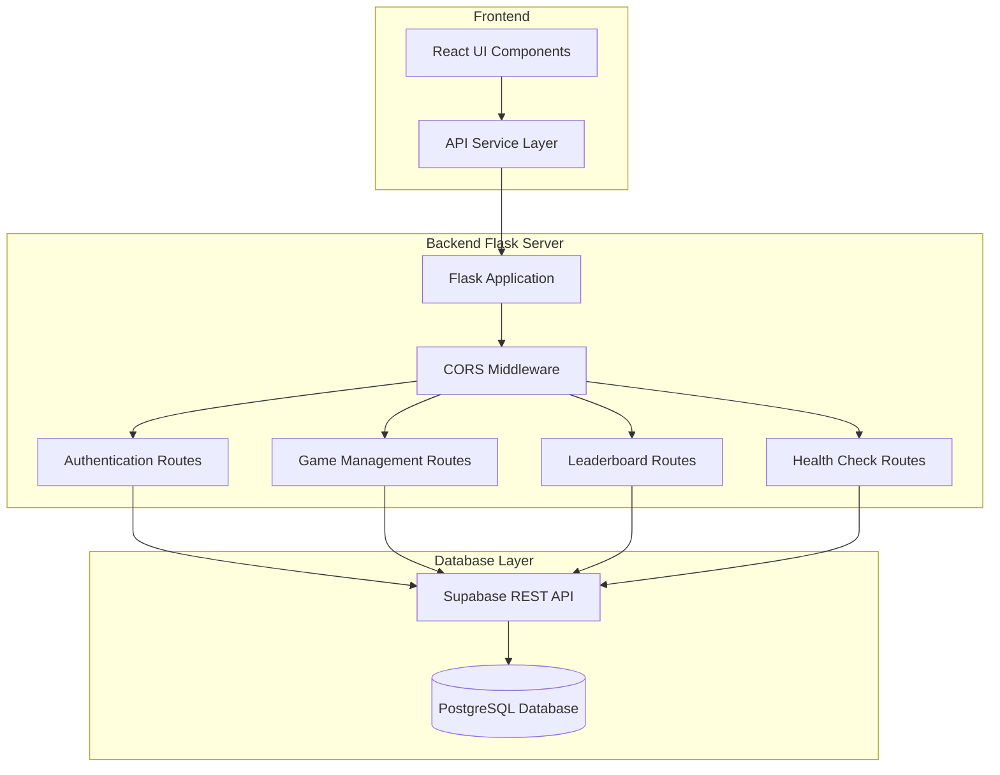
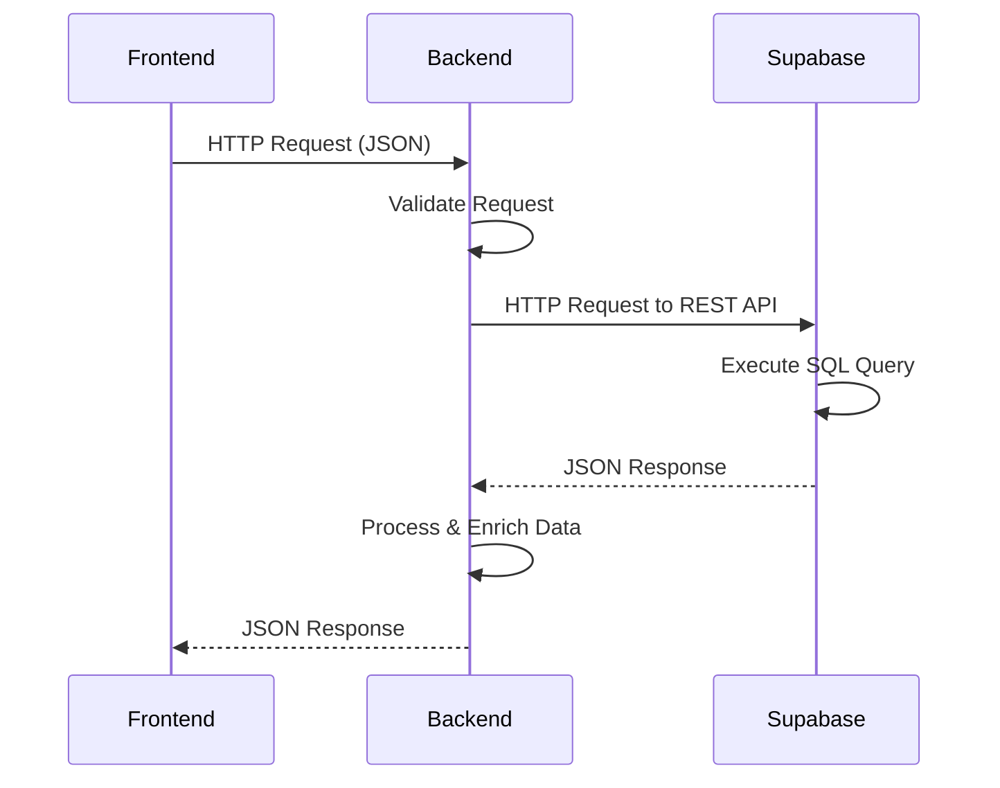

# Quantum Quest Backend API

## Overview

The Quantum Quest backend is a Flask-based REST API server that provides authentication, game session management, and leaderboard functionality for the quantum physics escape room game. It integrates with Supabase (PostgreSQL) for data persistence and uses HTTP-based communication for maximum compatibility.

## Architecture



## Core Components

### Flask Application Structure

The backend follows a single-file architecture for simplicity and ease of deployment:

- **production_server.py**: Main Flask application with all routes and business logic
- **Configuration**: Supabase connection parameters and HTTP headers
- **Error Handling**: Comprehensive exception handling with fallback responses
- **CORS Support**: Cross-origin resource sharing for frontend-backend communication

### Data Flow Architecture



## API Endpoints

### Authentication System

#### User Registration
```http
POST /api/auth/signup
Content-Type: application/json

{
  "email": "user@example.com",
  "username": "player123",
  "full_name": "John Doe"
}
```

**Implementation Details:**
- Validates email uniqueness before creation
- Auto-generates username from email if not provided
- Creates initial leaderboard entry for new users
- Uses Supabase REST API for database operations
- Implements proper error handling for duplicate accounts

#### User Authentication
```http
POST /api/auth/login
POST /api/auth/signin  # Alias for compatibility
Content-Type: application/json

{
  "email": "user@example.com"
}
```

**Implementation Details:**
- Searches users table by email address
- Updates last_login timestamp on successful authentication
- Returns complete user profile data
- Handles database connection failures gracefully

### Game Session Management

#### Session Creation
```http
POST /api/game/start
Content-Type: application/json

{
  "user_id": "uuid-string",
  "difficulty": "easy|medium|hard"
}
```

**Implementation Details:**
- Creates new game_sessions record
- Initializes room progression tracking
- Sets up timing and attempt counters
- Generates unique session identifier

#### Progress Tracking
```http
POST /api/game/save-progress
Content-Type: application/json

{
  "session_id": "uuid-string",
  "current_room": "superposition",
  "room_times": {"superposition": 120},
  "room_attempts": {"superposition": 3}
}
```

#### Game Completion
```http
POST /api/game/complete
Content-Type: application/json

{
  "user_id": "uuid-string",
  "session_id": "uuid-string",
  "completion_time": 300,
  "total_score": 1500,
  "difficulty": "medium",
  "rooms_completed": 3,
  "hints_used": 2
}
```

**Implementation Details:**
- Updates user statistics (games_completed, total_score, best_completion_time)
- Creates leaderboard entry for the completed game
- Marks game session as completed with final metrics
- Uses database transactions for data consistency

### Leaderboard System

#### Score-Based Rankings
```http
GET /api/leaderboard/score
```

**Response Structure:**
```json
{
  "entries": [
    {
      "rank": 1,
      "user_id": "uuid",
      "username": "player123",
      "full_name": "John Doe",
      "total_score": 4500,
      "completion_time": 180,
      "difficulty": "hard",
      "rooms_completed": 3,
      "hints_used": 0,
      "achieved_at": "2025-06-29T12:00:00Z"
    }
  ],
  "type": "score",
  "source": "database"
}
```

#### Speed-Based Rankings
```http
GET /api/leaderboard/speed
```

**Implementation Details:**
- Queries leaderboard_entries table with appropriate ordering
- Enriches entries with user profile data (username, full_name)
- Implements rank calculation and numbering
- Provides fallback demo data when database is empty
- Supports multiple data sources (database, user_stats, demo)

### System Monitoring

#### Health Check
```http
GET /health
```

**Response:**
```json
{
  "status": "healthy",
  "quantum_engine": "operational",
  "database": "connected",
  "websockets": "active"
}
```

**Implementation Details:**
- Tests Supabase connectivity with timeout
- Validates database access permissions
- Returns detailed system status information
- Used for monitoring and deployment verification

## Database Integration

### Supabase Configuration

The backend uses Supabase's REST API for all database operations:

```python
SUPABASE_URL = "https://project-id.supabase.co"
SUPABASE_ANON_KEY = "anonymous-key"
SUPABASE_REST_URL = f"{SUPABASE_URL}/rest/v1"
```

### HTTP Headers Configuration

```python
def get_supabase_headers(use_service_key=False):
    key = SUPABASE_SERVICE_KEY if use_service_key else SUPABASE_ANON_KEY
    return {
        "apikey": key,
        "Authorization": f"Bearer {key}",
        "Content-Type": "application/json",
        "Prefer": "return=representation"
    }
```

### Database Operations

#### Create Operations
```python
response = requests.post(
    f"{SUPABASE_REST_URL}/users",
    headers=get_supabase_headers(),
    json=user_data
)
```

#### Read Operations
```python
response = requests.get(
    f"{SUPABASE_REST_URL}/users?email=eq.{email}",
    headers=get_supabase_headers()
)
```

#### Update Operations
```python
response = requests.patch(
    f"{SUPABASE_REST_URL}/users?id=eq.{user_id}",
    headers=get_supabase_headers(),
    json=update_data
)
```

## Error Handling Strategy

### Graceful Degradation

The backend implements comprehensive error handling with fallback mechanisms:

1. **Database Failures**: Returns demo data when Supabase is unreachable
2. **Authentication Errors**: Provides clear error messages for invalid credentials
3. **Validation Errors**: Returns specific validation failure details
4. **Network Timeouts**: Implements timeout handling for external API calls

### Exception Handling Pattern

```python
try:
    # Primary operation (database interaction)
    response = requests.post(...)
    if response.status_code in [200, 201]:
        return jsonify({"success": True, "data": response.json()})
    else:
        return jsonify({"error": f"Database error: {response.status_code}"}), 500
except Exception as e:
    # Fallback operation or error response
    return jsonify({"error": f"Operation failed: {str(e)}"}), 500
```

## Frontend Compatibility Features

### AI Models Endpoint

The `/v1/models` endpoint exists for frontend compatibility and potential future AI integration:

```python
@app.route('/v1/models', methods=['GET'])
def get_models():
    return jsonify({
        "models": [
            {
                "id": "quantum-gpt",
                "name": "Quantum GPT",
                "description": "AI model for quantum computing help"
            }
        ]
    })
```

**Important Note**: This is currently a **placeholder endpoint only**. There is no actual AI integration, no "Quantum GPT" model, and no AI service connected to the backend. The endpoint returns static mock data for frontend compatibility. This exists for potential future extensibility if AI-powered hints, explanations, or quantum problem-solving assistance are added to the game.

**Current Status**: 
- No AI models are implemented
- No external AI APIs are called
- No machine learning functionality exists
- The response is purely static JSON data

### CORS Configuration

```python
from flask_cors import CORS
app = Flask(__name__)
CORS(app)  # Enable CORS for all routes
```

This enables cross-origin requests from the frontend development server.

## Data Models

### User Model
```python
user_data = {
    "email": str,
    "username": str,
    "full_name": str,
    "created_at": datetime,
    "is_verified": bool,
    "is_premium": bool,
    "total_playtime": int,      # seconds
    "games_completed": int,
    "best_completion_time": int, # seconds
    "total_score": int,
    "quantum_mastery_level": int,
    "is_active": bool
}
```

### Game Session Model
```python
game_session = {
    "user_id": str,
    "started_at": datetime,
    "difficulty": str,          # easy, medium, hard
    "current_room": str,        # superposition, entanglement, tunneling
    "is_completed": bool,
    "room_times": dict,         # {"room_name": seconds}
    "room_attempts": dict       # {"room_name": attempt_count}
}
```

### Leaderboard Entry Model
```python
leaderboard_entry = {
    "user_id": str,
    "session_id": str,
    "category": str,            # total_score, completion_time
    "completion_time": int,     # seconds
    "total_score": int,
    "difficulty": str,
    "rooms_completed": int,
    "hints_used": int,
    "achieved_at": datetime
}
```

## Security Considerations

### Row Level Security (RLS)

The backend relies on Supabase's Row Level Security for data protection:

```sql
-- Enable RLS on all tables
ALTER TABLE users ENABLE ROW LEVEL SECURITY;
ALTER TABLE leaderboard_entries ENABLE ROW LEVEL SECURITY;
ALTER TABLE game_sessions ENABLE ROW LEVEL SECURITY;

-- Create permissive policies for development
CREATE POLICY "Allow all operations" ON users FOR ALL USING (true) WITH CHECK (true);
```

### API Key Management

- Uses Supabase anonymous key for public operations
- Service role key reserved for administrative operations
- API keys configured via environment variables

## Performance Optimizations

### Database Query Optimization

1. **Leaderboard Queries**: Use database-level ordering and limiting
2. **User Lookups**: Query by indexed email field
3. **Data Enrichment**: Separate queries for user profile data to avoid large joins

### Response Caching Strategy

The backend implements intelligent fallback mechanisms:

1. **Primary**: Real-time database queries
2. **Secondary**: Aggregated user statistics
3. **Tertiary**: Static demo data

## Deployment Configuration

### Environment Variables

```bash
SUPABASE_URL=https://your-project.supabase.co
SUPABASE_ANON_KEY=your-anonymous-key
SUPABASE_SERVICE_KEY=your-service-role-key
```

### Production Considerations

1. **WSGI Server**: Replace Flask dev server with Gunicorn or uWSGI
2. **Environment Variables**: Use secure credential management
3. **Database Connection Pooling**: Configure for high-concurrency scenarios
4. **Monitoring**: Implement logging and health check endpoints
5. **Rate Limiting**: Add request rate limiting for API endpoints

## Development Setup

### Prerequisites
- Python 3.8+
- conda (recommended) or pip
- Access to Supabase project

### Installation
```bash
conda create -n qplaytrial python=3.11 -y
conda activate qplaytrial
conda install -c conda-forge flask flask-cors requests -y
```

### Configuration
```bash
# Create .env file
cp .env.example .env
# Edit .env with your Supabase credentials
```

### Running the Server
```bash
python production_server.py
```

The server will start on `http://localhost:8000` with debug mode enabled for development.

## Testing

### Health Check
```bash
curl http://localhost:8000/health
```

### API Testing
```bash
# Test user signup
curl -X POST http://localhost:8000/api/auth/signup \
  -H "Content-Type: application/json" \
  -d '{"email":"test@example.com","username":"testuser"}'

# Test leaderboard
curl http://localhost:8000/api/leaderboard/score
```

### Database Connectivity
```bash
curl http://localhost:8000/api/test-supabase
```
