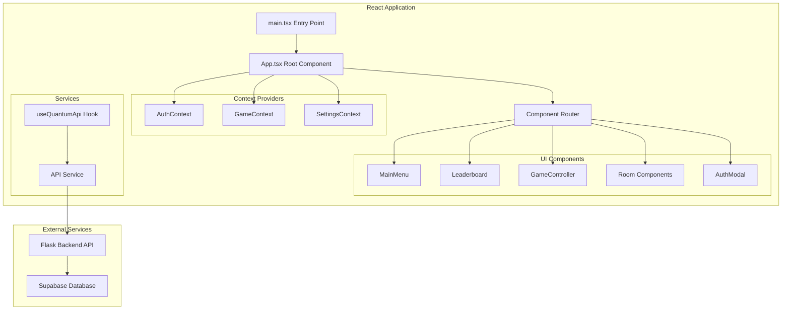

# Quantum Quest Frontend

## Overview

The Quantum Quest frontend is a modern React application built with TypeScript and Vite that provides an interactive quantum physics escape room experience. It features real-time authentication, leaderboards, game progression tracking, and scientifically-themed UI components.

## Architecture



## Technology Stack

### Core Framework
- **React 18**: Component-based UI framework with hooks
- **TypeScript**: Type-safe JavaScript with compile-time error checking
- **Vite**: Fast build tool and development server
- **Tailwind CSS**: Utility-first CSS framework for styling

### State Management
- **React Context API**: Global state management for auth, game, and settings
- **useState/useEffect**: Local component state management
- **Custom Hooks**: Reusable stateful logic (useQuantumApi)

### Development Tools
- **ESLint**: Code linting and style enforcement
- **PostCSS**: CSS processing and optimization
- **TypeScript Config**: Strict type checking configuration

## Project Structure

```
src/
├── main.tsx                 # Application entry point
├── App.tsx                  # Root component with providers
├── index.css               # Global styles and Tailwind imports
├── vite-env.d.ts           # Vite type definitions
├── components/             # React components
│   ├── MainMenu.tsx        # Main game menu interface
│   ├── Leaderboard.tsx     # Score and speed rankings
│   ├── GameController.tsx  # Game state management
│   ├── Settings.tsx        # User preferences
│   ├── Achievements.tsx    # Achievement tracking
│   ├── QuantumGuide.tsx    # Physics explanations
│   ├── RoomSelector.tsx    # Room selection interface
│   ├── auth/               # Authentication components
│   │   └── AuthModal.tsx   # Login/signup modal
│   ├── rooms/              # Game room components
│   │   ├── SuperpositionTower.tsx
│   │   ├── EntanglementBridge.tsx
│   │   ├── TunnelingVault.tsx
│   │   ├── ProbabilityBay.tsx
│   │   ├── StateChambrer.tsx
│   │   └── QuantumArchive.tsx
│   └── ui/                 # Reusable UI components
│       ├── Button.tsx      # Styled button component
│       └── ThemeProvider.tsx # Dark/light theme management
├── contexts/               # React Context providers
│   ├── AuthContext.tsx     # User authentication state
│   ├── GameContext.tsx     # Game progress and state
│   └── SettingsContext.tsx # User preferences
├── services/               # External service integrations
│   └── api.ts             # Backend API communication
├── hooks/                  # Custom React hooks
│   └── useQuantumApi.ts   # Quantum game API integration
└── types/                  # TypeScript type definitions
    └── game.ts            # Game-related type definitions
```

# Making UI Changes

The UI is built with **React** (TypeScript) and **Tailwind CSS**. All main UI logic and components are in the `src/components/` directory. Here’s how to make changes:

### 1. Locate the Component
- **Main screens**: `src/components/MainMenu.tsx`, `GameController.tsx`, `Leaderboard.tsx`, etc.
- **UI elements**: `src/components/ui/` (e.g., `Button.tsx`, `ThemeProvider.tsx`)
- **Rooms**: `src/components/rooms/` (each quantum room is a separate file)

### 2. Edit the Component
- Open the relevant `.tsx` file.
- Use React/JSX to add, remove, or modify UI elements.
- Use Tailwind CSS classes for styling (e.g., `bg-gradient-to-br`, `text-white`).
- For new UI, create a new file in `components/` or `components/ui/` and export your component.

### 3. Update State or Context
- Use React hooks (`useState`, `useEffect`) for local state.
- Use Contexts (`AuthContext`, `GameContext`, `SettingsContext`) for global state. Update or consume context values as needed.
- To add new global state, update the relevant context in `src/contexts/` and its provider.

### 4. Preview Changes
- Run `npm run dev` to start the local dev server.
- UI changes update live thanks to Vite’s hot reload.

### 5. Add/Update Styles
- Use Tailwind utility classes directly in JSX.
- For custom styles, edit `src/index.css` or extend Tailwind in `tailwind.config.js`.

---

## Making Changes to Quantum Logic (Step-by-Step for Beginners)

Quantum logic (the rules, puzzles, and physics) is what makes the game unique. You can change how the quantum puzzles work, add new rooms, or update the game flow. Here’s a very beginner-friendly guide—even if you don’t know React or TypeScript!

### 1. What is a Room Component?
- Each quantum puzzle or challenge is a **Room Component** (a file in `src/components/rooms/`).
- Each file (like `SuperpositionTower.tsx`) is a self-contained mini-app for that puzzle.
- You can think of it as a “level” in the game.

### 2. How to Find and Open a Room
- Go to `src/components/rooms/` in your code editor.
- Each `.tsx` file is a different quantum room (e.g., `SuperpositionTower.tsx`).
- Open the file you want to change.

### 3. Understanding the Structure
- At the top, you’ll see `import` lines—these bring in tools and helpers. You usually don’t need to change these.
- The main part starts with `const RoomName = () => { ... }` or `function RoomName() { ... }`.
- Inside, you’ll see lines like `const [state, setState] = useState(...)`—these are variables that store the quantum state, user progress, etc.
- The `return (...)` part is the UI: what the player sees and interacts with.

### 4. Changing the Quantum Logic
- **To change the puzzle rules:**
  - Find the functions or code that check if the player’s answer is correct, or that update the quantum state.
  - Example: If you see `if (userInput === correctAnswer) { ... }`, you can change `correctAnswer` to something else.
  - To change how the quantum state updates, look for lines with `setState(...)` or similar.
- **To change what happens when a player completes a room:**
  - Look for a function called when the player “wins” (often named `completeRoom`, `onComplete`, or similar).
  - You can change the score, add a message, or trigger new logic here.

### 5. Adding a New Quantum Room (Copy-Paste )
1. Copy an existing room file (e.g., `SuperpositionTower.tsx`) and rename it (e.g., `TeleportationLab.tsx`).
2. Open your new file and change the name everywhere (e.g., `SuperpositionTower` → `TeleportationLab`).
3. Change the puzzle logic and UI as you like (see above).
4. Add your new room to the room selector:
   - Open `RoomSelector.tsx` and add an entry for your new room.
   - Open `GameController.tsx` and make sure your new room is included in the game flow.
5. (Optional) Update `src/types/game.ts` if you want to add new types of quantum states or results.

### 6. Example: Make a Simple Change
Suppose you want to change the correct answer in a room:
- Find a line like `const correctAnswer = "up";` and change it to `const correctAnswer = "down";`.
- Or, if you want to change the number of steps, find a line like `const maxSteps = 3;` and change the number.

### 7. Testing Your Changes
- Save the file.
- In your terminal, run `npm run dev` (if it’s not already running).
- Open the game in your browser (usually at http://localhost:5173 or similar).
- Play the room you changed and see if your update works!

---

- You don’t need to understand all the React code—just look for the variables and functions that match what you want to change.
- If you want to add a button, copy an existing `<button>...</button>` line and change the text or what it does.
- If you want to show a message, add a new line inside the `return (...)` part, like `<div>Congratulations!</div>`.

---

**Summary:**
- Each quantum puzzle is a file in `src/components/rooms/`.
- Open the file, find the logic or text you want to change, and edit it.
- Save and test your changes in the browser.
- You can copy existing rooms to make new ones.
- Don’t worry if you don’t know React—just follow the patterns you see!
