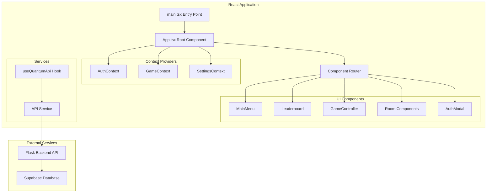
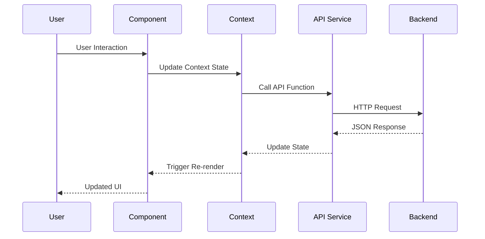

# Quantum Quest Frontend

## Overview

The Quantum Quest frontend is a modern React application built with TypeScript and Vite that provides an interactive quantum physics escape room experience. It features real-time authentication, leaderboards, game progression tracking, and scientifically-themed UI components.

## Architecture



## Technology Stack

### Core Framework
- **React 18**: Component-based UI framework with hooks
- **TypeScript**: Type-safe JavaScript with compile-time error checking
- **Vite**: Fast build tool and development server
- **Tailwind CSS**: Utility-first CSS framework for styling

### State Management
- **React Context API**: Global state management for auth, game, and settings
- **useState/useEffect**: Local component state management
- **Custom Hooks**: Reusable stateful logic (useQuantumApi)

### Development Tools
- **ESLint**: Code linting and style enforcement
- **PostCSS**: CSS processing and optimization
- **TypeScript Config**: Strict type checking configuration

## Project Structure

```
src/
├── main.tsx                 # Application entry point
├── App.tsx                  # Root component with providers
├── index.css               # Global styles and Tailwind imports
├── vite-env.d.ts           # Vite type definitions
├── components/             # React components
│   ├── MainMenu.tsx        # Main game menu interface
│   ├── Leaderboard.tsx     # Score and speed rankings
│   ├── GameController.tsx  # Game state management
│   ├── Settings.tsx        # User preferences
│   ├── Achievements.tsx    # Achievement tracking
│   ├── QuantumGuide.tsx    # Physics explanations
│   ├── RoomSelector.tsx    # Room selection interface
│   ├── auth/               # Authentication components
│   │   └── AuthModal.tsx   # Login/signup modal
│   ├── rooms/              # Game room components
│   │   ├── SuperpositionTower.tsx
│   │   ├── EntanglementBridge.tsx
│   │   ├── TunnelingVault.tsx
│   │   ├── ProbabilityBay.tsx
│   │   ├── StateChambrer.tsx
│   │   └── QuantumArchive.tsx
│   └── ui/                 # Reusable UI components
│       ├── Button.tsx      # Styled button component
│       └── ThemeProvider.tsx # Dark/light theme management
├── contexts/               # React Context providers
│   ├── AuthContext.tsx     # User authentication state
│   ├── GameContext.tsx     # Game progress and state
│   └── SettingsContext.tsx # User preferences
├── services/               # External service integrations
│   └── api.ts             # Backend API communication
├── hooks/                  # Custom React hooks
│   └── useQuantumApi.ts   # Quantum game API integration
└── types/                  # TypeScript type definitions
    └── game.ts            # Game-related type definitions
```

## Component Architecture

### Data Flow Pattern



### Context Management

#### AuthContext
```typescript
interface AuthContextType {
  user: User | null;
  login: (email: string) => Promise<boolean>;
  signup: (userData: SignupData) => Promise<boolean>;
  logout: () => void;
  isAuthenticated: boolean;
  loading: boolean;
}
```

**Implementation Details:**
- Manages user authentication state globally
- Provides login/signup/logout functionality
- Persists authentication state across page reloads
- Handles API communication for auth operations

#### GameContext
```typescript
interface GameContextType {
  currentRoom: string;
  gameProgress: GameProgress;
  startGame: (difficulty: string) => Promise<void>;
  completeRoom: (roomId: string, score: number) => Promise<void>;
  saveProgress: () => Promise<void>;
  gameStats: GameStats;
}
```

**Implementation Details:**
- Tracks current game session and progress
- Manages room transitions and completions
- Handles score calculation and submission
- Synchronizes with backend for persistent storage

#### SettingsContext
```typescript
interface SettingsContextType {
  theme: 'dark' | 'light';
  soundEnabled: boolean;
  difficulty: 'easy' | 'medium' | 'hard';
  updateSettings: (settings: Partial<Settings>) => void;
}
```

## Key Components

### MainMenu Component

The central hub for game navigation and user interaction.

```typescript
const MainMenu: React.FC = () => {
  const { user, isAuthenticated } = useAuth();
  const { gameStats } = useGame();
  const [activeTab, setActiveTab] = useState('play');
  
  // Component implementation
};
```

**Features:**
- Tab-based navigation (Play, Leaderboard, Settings, Guide)
- User profile display with statistics
- Responsive design for different screen sizes
- Integration with authentication and game contexts

### Leaderboard Component

Displays real-time rankings with multiple categories.

```typescript
interface LeaderboardEntry {
  rank: number;
  username: string;
  total_score: number;
  completion_time: number;
  difficulty: string;
}

const Leaderboard: React.FC = () => {
  const [leaderboardData, setLeaderboardData] = useState<LeaderboardData | null>(null);
  const [activeCategory, setActiveCategory] = useState<'score' | 'speed'>('score');
  
  // Real-time data fetching and display
};
```

**Features:**
- Score-based and speed-based rankings
- Real-time data updates from backend
- User highlighting for current player
- Responsive table design with ranking indicators

### AuthModal Component

Handles user authentication with form validation.

```typescript
const AuthModal: React.FC<AuthModalProps> = ({ isOpen, onClose, mode }) => {
  const [formData, setFormData] = useState<AuthFormData>({});
  const [errors, setErrors] = useState<FormErrors>({});
  const { login, signup } = useAuth();
  
  // Form handling and validation
};
```

**Features:**
- Toggle between login and signup modes
- Form validation with error messaging
- Loading states during API calls
- Integration with AuthContext for state management

### Room Components

Individual quantum physics challenges with interactive elements.

```typescript
const SuperpositionTower: React.FC = () => {
  const [quantumState, setQuantumState] = useState<QuantumState>('superposition');
  const [measurements, setMeasurements] = useState<Measurement[]>([]);
  const { completeRoom } = useGame();
  
  // Quantum physics simulation and game logic
};
```

**Features:**
- Interactive quantum physics simulations
- Progress tracking and hint systems
- Score calculation based on performance
- Educational content with scientific accuracy

## API Integration

### API Service Layer

The frontend communicates with the backend through a centralized API service:

```typescript
class ApiService {
  private baseURL = 'http://localhost:8000';
  
  async get<T>(endpoint: string): Promise<T> {
    const response = await fetch(`${this.baseURL}${endpoint}`);
    if (!response.ok) throw new Error(`API Error: ${response.status}`);
    return response.json();
  }
  
  async post<T>(endpoint: string, data: any): Promise<T> {
    const response = await fetch(`${this.baseURL}${endpoint}`, {
      method: 'POST',
      headers: { 'Content-Type': 'application/json' },
      body: JSON.stringify(data)
    });
    if (!response.ok) throw new Error(`API Error: ${response.status}`);
    return response.json();
  }
}
```

### API Endpoints Used

#### Authentication
```typescript
// User signup
const signupResponse = await api.post('/api/auth/signup', {
  email: string,
  username: string,
  full_name: string
});

// User login
const loginResponse = await api.post('/api/auth/login', {
  email: string
});
```

#### Game Data
```typescript
// Get leaderboard
const leaderboard = await api.get('/api/leaderboard/score');

// Start game session
const session = await api.post('/api/game/start', {
  user_id: string,
  difficulty: string
});

// Complete game
const completion = await api.post('/api/game/complete', {
  user_id: string,
  session_id: string,
  completion_time: number,
  total_score: number
});
```

## State Management Patterns

### Context Provider Setup

```typescript
function App() {
  return (
    <AuthProvider>
      <SettingsProvider>
        <GameProvider>
          <ThemeProvider>
            <div className="App">
              {/* Application components */}
            </div>
          </ThemeProvider>
        </GameProvider>
      </SettingsProvider>
    </AuthProvider>
  );
}
```

### Custom Hooks Pattern

```typescript
const useQuantumApi = () => {
  const [loading, setLoading] = useState(false);
  const [error, setError] = useState<string | null>(null);
  
  const measureQuantumState = useCallback(async (state: QuantumState) => {
    setLoading(true);
    try {
      const result = await api.post('/api/quantum/measure', { state });
      return result;
    } catch (err) {
      setError(err.message);
      throw err;
    } finally {
      setLoading(false);
    }
  }, []);
  
  return { measureQuantumState, loading, error };
};
```

## Styling and UI

### Tailwind CSS Configuration

```javascript
// tailwind.config.js
module.exports = {
  content: ['./src/**/*.{js,ts,jsx,tsx}'],
  theme: {
    extend: {
      colors: {
        quantum: {
          primary: '#8B5CF6',
          secondary: '#A78BFA',
          accent: '#C4B5FD'
        }
      },
      fontFamily: {
        'quantum': ['Orbitron', 'monospace'],
        'tech': ['Rajdhani', 'sans-serif']
      }
    }
  },
  plugins: []
};
```

### Component Styling Patterns

```typescript
const Button: React.FC<ButtonProps> = ({ variant = 'primary', size = 'md', children, ...props }) => {
  const baseClasses = 'font-quantum font-semibold rounded-lg transition-all duration-200';
  const variantClasses = {
    primary: 'bg-quantum-primary hover:bg-quantum-secondary text-white',
    secondary: 'bg-gray-700 hover:bg-gray-600 text-gray-100',
    danger: 'bg-red-600 hover:bg-red-700 text-white'
  };
  const sizeClasses = {
    sm: 'px-3 py-1.5 text-sm',
    md: 'px-4 py-2 text-base',
    lg: 'px-6 py-3 text-lg'
  };
  
  return (
    <button 
      className={`${baseClasses} ${variantClasses[variant]} ${sizeClasses[size]}`}
      {...props}
    >
      {children}
    </button>
  );
};
```

## Performance Optimizations

### Code Splitting
```typescript
// Lazy loading for room components
const SuperpositionTower = lazy(() => import('./rooms/SuperpositionTower'));
const EntanglementBridge = lazy(() => import('./rooms/EntanglementBridge'));

// Suspense wrapper for loading states
<Suspense fallback={<LoadingSpinner />}>
  <SuperpositionTower />
</Suspense>
```

### Memoization
```typescript
// Memoized expensive calculations
const gameStats = useMemo(() => {
  return calculateGameStatistics(gameProgress, userHistory);
}, [gameProgress, userHistory]);

// Memoized component renders
const LeaderboardEntry = memo(({ entry }: { entry: LeaderboardEntry }) => {
  return <div>{/* Component content */}</div>;
});
```

### API Caching
```typescript
// Simple in-memory cache for API responses
const cache = new Map<string, { data: any; timestamp: number }>();

const getCachedData = (key: string, ttl: number = 5000) => {
  const cached = cache.get(key);
  if (cached && Date.now() - cached.timestamp < ttl) {
    return cached.data;
  }
  return null;
};
```

## Error Handling

### Error Boundaries
```typescript
class ErrorBoundary extends React.Component {
  constructor(props) {
    super(props);
    this.state = { hasError: false };
  }

  static getDerivedStateFromError(error) {
    return { hasError: true };
  }

  componentDidCatch(error, errorInfo) {
    console.error('Game Error:', error, errorInfo);
  }

  render() {
    if (this.state.hasError) {
      return <ErrorFallback />;
    }
    return this.props.children;
  }
}
```

### API Error Handling
```typescript
const handleApiError = (error: Error) => {
  if (error.message.includes('401')) {
    // Handle authentication errors
    logout();
    showNotification('Please log in again', 'error');
  } else if (error.message.includes('500')) {
    // Handle server errors
    showNotification('Server error. Please try again.', 'error');
  } else {
    // Handle network errors
    showNotification('Connection error. Check your internet.', 'error');
  }
};
```

## Development Workflow

### Local Development Setup

```bash
# Install dependencies
npm install

# Start development server
npm run dev

# Run type checking
npm run type-check

# Run linting
npm run lint

# Build for production
npm run build
```

### Environment Configuration

The frontend automatically connects to the backend on `localhost:8000`. No additional environment configuration is required for local development.

### Development Server Features

- **Hot Module Replacement (HMR)**: Instant updates during development
- **TypeScript Error Reporting**: Real-time type checking in browser
- **Source Maps**: Debug with original TypeScript source code
- **Automatic Port Management**: Vite handles port conflicts automatically

## Testing Strategy

### Component Testing
```typescript
import { render, screen, fireEvent } from '@testing-library/react';
import { AuthProvider } from '../contexts/AuthContext';
import AuthModal from '../components/auth/AuthModal';

test('renders login form correctly', () => {
  render(
    <AuthProvider>
      <AuthModal isOpen={true} onClose={() => {}} mode="login" />
    </AuthProvider>
  );
  
  expect(screen.getByLabelText(/email/i)).toBeInTheDocument();
  expect(screen.getByRole('button', { name: /log in/i })).toBeInTheDocument();
});
```

### Integration Testing
```typescript
test('user can complete authentication flow', async () => {
  const mockUser = { id: '1', email: 'test@example.com', username: 'testuser' };
  
  // Mock API response
  fetchMock.mockResponseOnce(JSON.stringify({ success: true, user: mockUser }));
  
  render(<App />);
  
  // Simulate user interactions
  fireEvent.click(screen.getByText(/log in/i));
  fireEvent.change(screen.getByLabelText(/email/i), { target: { value: 'test@example.com' } });
  fireEvent.click(screen.getByRole('button', { name: /log in/i }));
  
  // Assert expected outcomes
  await waitFor(() => {
    expect(screen.getByText(`Welcome, ${mockUser.username}`)).toBeInTheDocument();
  });
});
```

## Build and Deployment

### Production Build
```bash
npm run build
```

**Build Output:**
- **dist/**: Production-ready static files
- **Optimized Assets**: Minified JS/CSS, optimized images
- **Source Maps**: For production debugging (optional)

### Deployment Considerations

1. **Static File Hosting**: Can be deployed to any static hosting service
2. **API Endpoint Configuration**: Update API base URL for production
3. **Environment Variables**: Configure for production backend URL
4. **HTTPS Requirements**: Required for secure authentication
5. **CDN Integration**: For improved global performance

### Production Configuration

```typescript
// Configure API base URL for production
const API_BASE_URL = process.env.NODE_ENV === 'production' 
  ? 'https://your-backend-domain.com'
  : 'http://localhost:8000';
```

## Browser Compatibility

### Supported Browsers
- **Chrome 90+**: Full feature support
- **Firefox 88+**: Full feature support
- **Safari 14+**: Full feature support
- **Edge 90+**: Full feature support

### Progressive Enhancement
- **Core Functionality**: Works on all modern browsers
- **Advanced Features**: Enhanced experience on latest browsers
- **Fallbacks**: Graceful degradation for unsupported features

## Security Considerations

### Client-Side Security
- **Input Validation**: All user inputs validated before API calls
- **XSS Prevention**: React's built-in XSS protection
- **CSRF Protection**: Not applicable for SPA with token auth
- **Secure API Communication**: HTTPS in production

### Data Protection
- **No Sensitive Data Storage**: Authentication handled server-side
- **Local Storage**: Only non-sensitive game preferences
- **API Token Management**: Handled by authentication context

This frontend provides a complete, modern React application for the Quantum Quest game with proper architecture, error handling, and development workflow.
